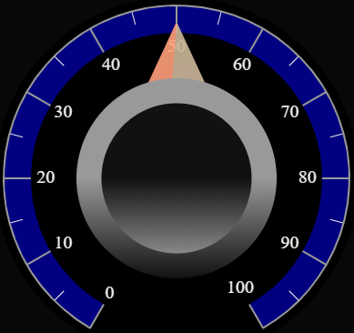
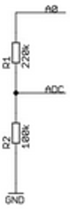
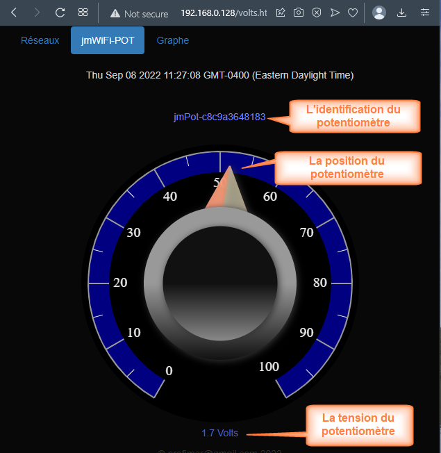
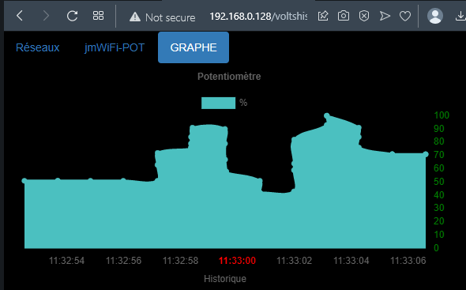
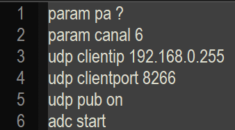
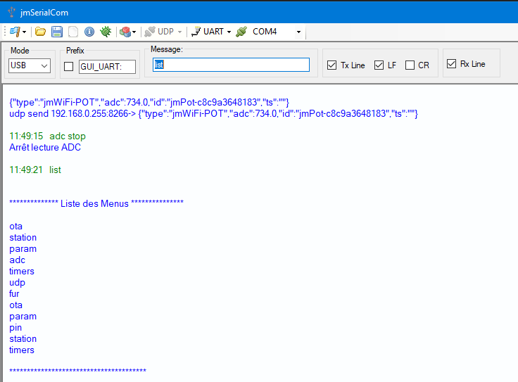
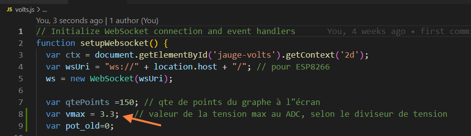

| profjmer@gmail.com                              |
|-------------------------------------------------|
| jmWiFi-Pot                                      |
| Obtenir la position d’un potentiomètre par WiFi |

<table>
<colgroup>
<col style="width: 100%" />
</colgroup>
<thead>
<tr class="header">
<th>
Jean Mercier

08/09/2022
</th>
</tr>
</thead>
<tbody>
</tbody>
</table>

# Sommaire

[Introduction [3](#introduction)](#introduction)

[Convertisseur analogique à numérique du Wemos D1 mini
[4](#convertisseur-analogique-à-numérique-du-wemos-d1-mini)](#convertisseur-analogique-à-numérique-du-wemos-d1-mini)

[Tension supérieure à 3.3 volts
[4](#tension-supérieure-à-3.3-volts)](#tension-supérieure-à-3.3-volts)

[Format des données transmises par jmWiFi-Pot
[4](#format-des-données-transmises-par-jmwifi-pot)](#format-des-données-transmises-par-jmwifi-pot)

[Site Web de jmWiFi-Pot
[5](#site-web-de-jmwifi-pot)](#site-web-de-jmwifi-pot)

[Configuration des transmissions UDP
[6](#configuration-des-transmissions-udp)](#configuration-des-transmissions-udp)

[Interface UART pour la configuration
[6](#interface-uart-pour-la-configuration)](#interface-uart-pour-la-configuration)

[Exemple de config.ini
[7](#exemple-de-config.ini)](#exemple-de-config.ini)

[Modules de jmWiFi-POT
[7](#modules-de-jmwifi-pot)](#modules-de-jmwifi-pot)

[Mesure de tensions supérieures à 3.3 volts
[9](#mesure-de-tensions-supérieures-à-3.3-volts)](#mesure-de-tensions-supérieures-à-3.3-volts)

[Volts.js [9](#volts.js)](#volts.js)

[Interfacer un bouton poussoir ou in interrupteur
[10](#interfacer-un-bouton-poussoir-ou-in-interrupteur)](#interfacer-un-bouton-poussoir-ou-in-interrupteur)

[Modification de l’aspect de la page Web
[10](#modification-de-laspect-de-la-page-web)](#modification-de-laspect-de-la-page-web)

[Différence entre une interface physique et logicielle
[11](#différence-entre-une-interface-physique-et-logicielle)](#différence-entre-une-interface-physique-et-logicielle)

jmWiFi-Pot

# Introduction

Ce document est une introduction aux capteurs intelligents.

Consulter le document capteurs en bref.pdf pour distinguer les
différents types de capteurs.

Ce document montre comment interfacer un capteur analogique.

Le capteur utilisé est un potentiomètre, mais tout autre capteur
analogique peut être également interfacé.

Ce document montre comment acquérir et transmettre une valeur analogique
par WiFi et la transmettre à d’autres systèmes ordinés.

La transmission peut être faite par trois voies de communication :
UART/UDP/http-Websocket.

Le curseur du potentiomètre est relié au convertisseur analogique du
Wemos D1 mini et permet de modifier la tension au convertisseur.

La valeur de la tension au curseur est transmise aux secondes ou bien
aux 300 ms si la position du curseur est modifiée.

Un simple bouton poussoir, bascule ou interrupteur peuvent également
remplacer le potentiomètre. On peut alors connaître leur position par
WiFi.

# Convertisseur analogique à numérique du Wemos D1 mini

L’entrée A0 du module Wemos
D1 est reliée à un diviseur de tension constitué de deux résistances.

Le nœud ADC est relié au CAN du ESP8266.

Celui-ci accepte une tension maximale de 1Volt.

Comme la résistance interne du CAN du ESP8266 est faible devant R2, si
on néglige cette résistance, alors la tension ADC est 100/(100+220) A0 =
A0/3.2

Ainsi si la tension A0 varie de 0 à 3.3 volts, la tension ADC varie de 0
à 1.03 volts.

## Tension supérieure à 3.3 volts

Pour mesurer une tension supérieure à 3.3 volts à la broche A0, il faut
ajouter en série avec R1 une autre résistance afin de créer un nouveau
diviseur de tension. La tension maximale en ADC ne doit pas dépasser 1
Volt.

# Format des données transmises par jmWiFi-Pot

On désire transmettre en format JSON:

- Le type de données transmises

- la valeur numérique du convertisseur CAN

- l’identité du potentiomètre

- un « timestamp » vide

Exemples :

{"type":"jmWiFi-POT","adc":7.0,"id":"jmPot-c8c9a3648183","ts":""}

{"type":"jmWiFi-POT","adc":1024.0,"id":"jmPot-c8c9a3648183","ts":""}

# Site Web de jmWiFi-Pot

Le site Web contient trois pages:

- Réseaux pour se joindre à un réseau (vue précédemment)

- jmWiFi-POT pour voir :

  - L’identification du potentiomètre

  - La position du potentiomètre

  - La valeur de la tension au curseur du potentiomètre

>  style="width:2.62353in;height:2.69099in" />

- Graphe pour voir les variations du potentiomètre dans le temps

# Configuration des transmissions UDP

Les messages peuvent être transmis à un client/port particulier ou bien
être broadcastés dans le réseau.

## Interface UART pour la configuration

Pour configurer l’application, l’interface UART est utilisée.

Connectez-vous physiquement au ESP8266 à l’aide de jmSerialCom ou un
autre terminal (voir vidéos précédentes).

Pour que les commandes soient permanentes, il faut les ajouter au
fichier config.ini

## Exemple de config.ini

Dans cet exemple, le PA conserve son nom par défaut, si jmWiFi-Pot se
joint à un réseau, l’adresse IP du client sera ici est l’adresse de
Broadcast dans le réseau, pour adresser un ordinateur en particulier
utiliser son adresse particulière.

Le port peut également être modifié. Ici l’autre système dans le réseau
est un autre ESP8266 écoutant au port 8266.

Pour publier en UDP, la publication UDP doit être activée.

Les conversions peuvent être démarrées/stoppées à l’aide de la commande
du module adc

# Modules de jmWiFi-POT

Les modules et leurs commandes sont accessibles via UART/UDP.
L’application Web n’a pas de page ILC.

Il est préférable de stopper la minuterie des conversions pour utiliser
les commandes.

# Mesure de tensions supérieures à 3.3 volts

Comme vu précédemment dans ce document, il est possible d’ajouter une
résistance pour augmenter la valeur du diviseur de tension à la broche
ADC.

Pour afficher la valeur de la tension dans la page jmWiFi-POT, il faut
modifier la valeur de la tension maximale dans le fichier volts.js

## Volts.js 

Si vous utilisez une autre tension que 3.3 volts, modifier la variable
vmax.

Pour une tension plus grande que 3.3 volts ajouter une résistance en
série dans le diviseur de tension.

# Interfacer un bouton poussoir ou in interrupteur 

On peut également interfacer un bouton poussoir, une bascule ou un
simple interrupteur au convertisseur analogique à numérique. La même
page Web peut être utilisée, le potentiomètre sera 0 ou 100 selon la
position du bouton poussoir ou de l’interrupteur.

# Modification de l’aspect de la page Web

La libraire jauge contient des attributs pour le rendu d’un jauge.

L’application jmWiFi-POT montre que la librairie canvas-gauge.min peut
également représenter un potentiomètre.

En modifiant les attributs on peut également représenter l’état d’un
bouton poussoir ou d’une bascule.

# Différence entre une interface physique et logicielle

Dans ce document nous avons
vu comment interfacer un capteur physique.

Le coût est faible et consiste au coût du capteur « potentiomètreÉ et du
Wemos D1 mini.

On peut également réaliser un potentiomètre à partir d’une page Web
semblable à la page jmWiFi-Pot sauf que l’utilisateur agit sur l’image
du potentiomètre pour transmettre les messages.

L’interface logicielle transmet alors le même type de message. Le
système ordiné recevant les messages ne distinguent pas la différence.

En résumé, l’interface physique utilise un vrai potentiomètre tandis
qu’une interface logicielle utilise une émulation du potentiomètre.
